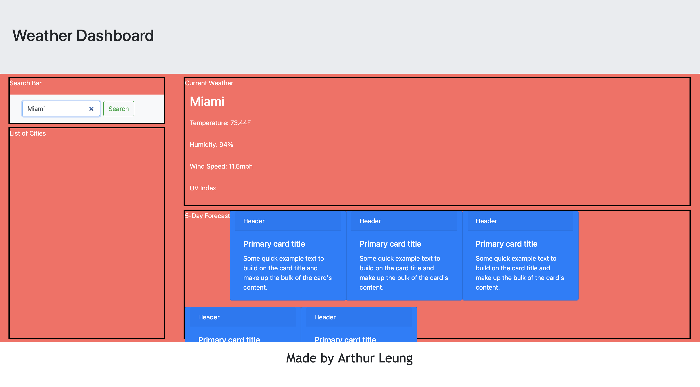

# ucd-arthurleung-hw6
Repository for Arthur Leung's sixth homework assignment

<strong>Name:</strong>
Weather Web Application

<strong>Purpose:</strong>
To create a responsive weather application that allows the user to search the current and 5-day weather forecast in all major US cities. Weather information includes: temperature, humidity, UV index and wind speeds. In addition, the application stores the search history of US cities, allowing them to return to access a previously search US city with ease. 

<strong>Installation/Access:</strong>
Internet access is required this webpage. The URL is attached below:

[Weather Application] https://artydabomb.github.io/ucd-arthurleung-hw6/

A sample picture of the webpage is as is (progress pending):

<strong>Code Modified by Arthur Leung</strong>

